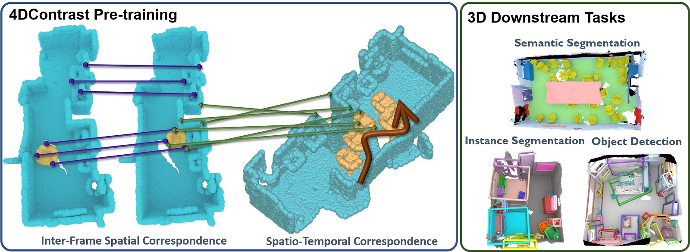

# 4DContrast: Contrastive Learning with Dynamic Correspondences for 3D Scene Understanding


[[ECCV 2022 Paper]](https://arxiv.org/abs/2112.02990) [[Video]](https://youtu.be/qhGhWZmJq3U) [[Project Page]](terencecyj.github.io/projects/4dcontrast.html)

## Citing our paper
```
@inproceedings{chen2022_4dcontrast,
      title={4DContrast: Contrastive Learning with Dynamic Correspondences for 3D Scene Understanding},
      author={Chen, Yujin and Nie{\ss}ner, Matthias and Dai, Angela},
      booktitle = {Proceedings of the European Conference on Computer Vision (ECCV)},
      year={2022}
}
```

## License
Contrastive Scene Contexts is relased under the MIT License. See the LICENSE file for more details.